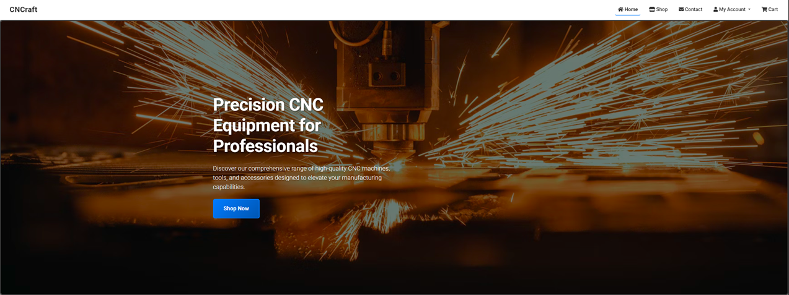
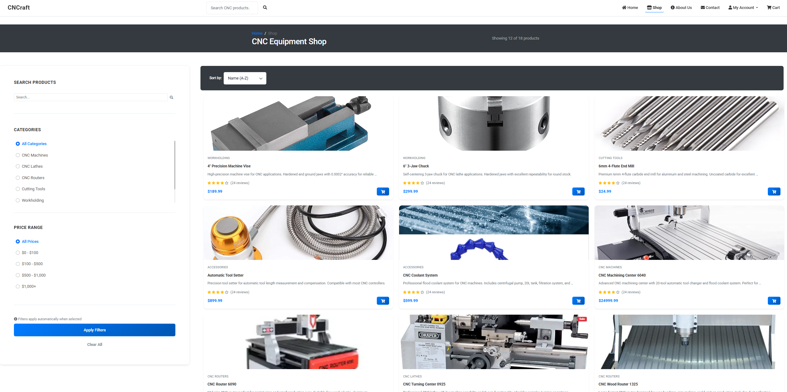
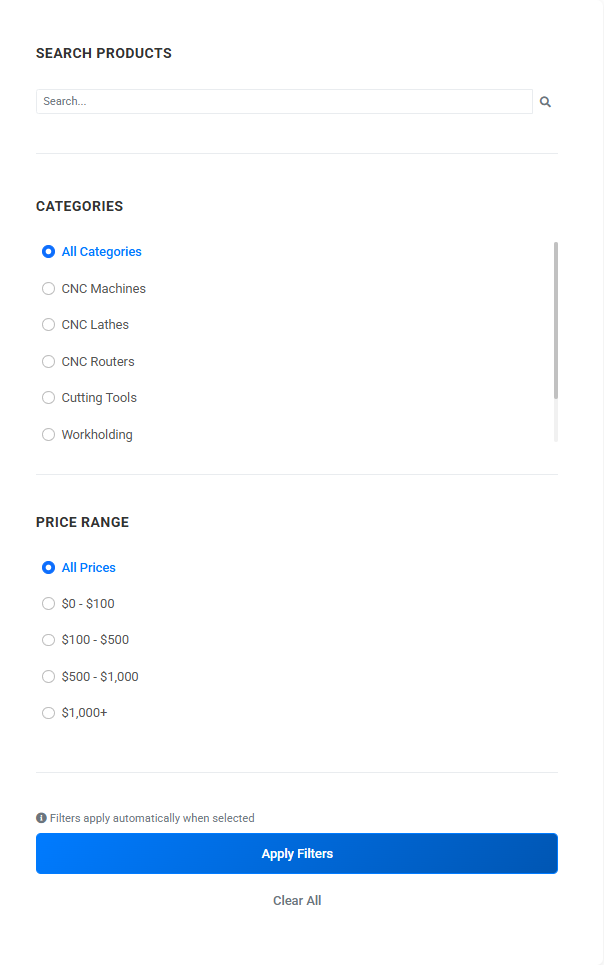
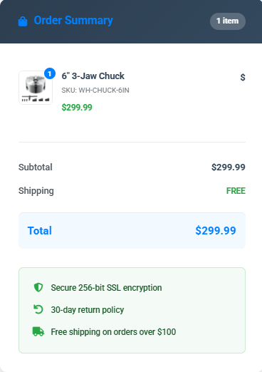
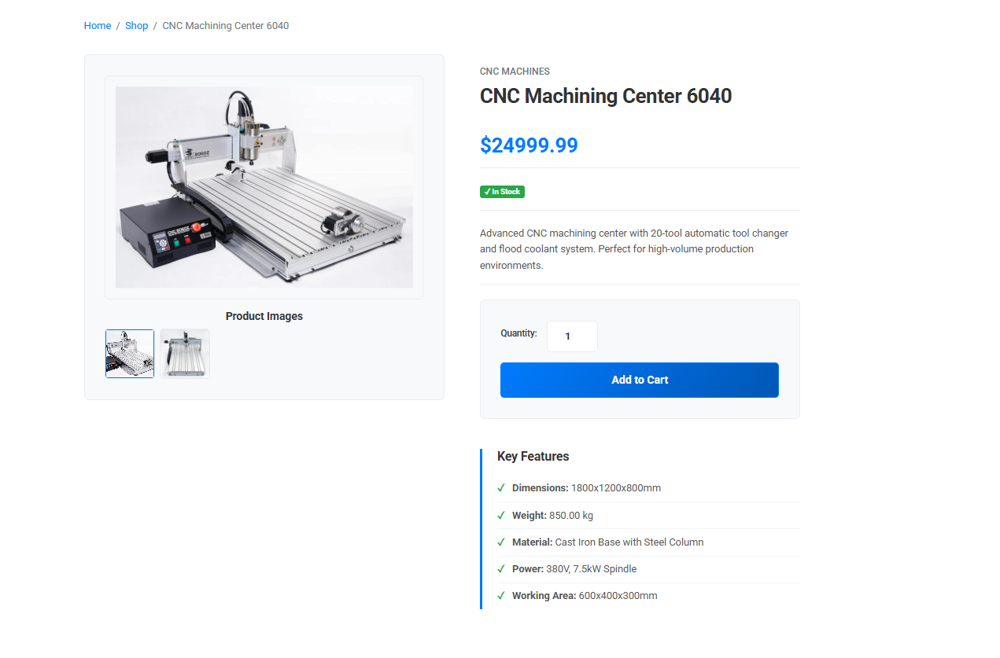
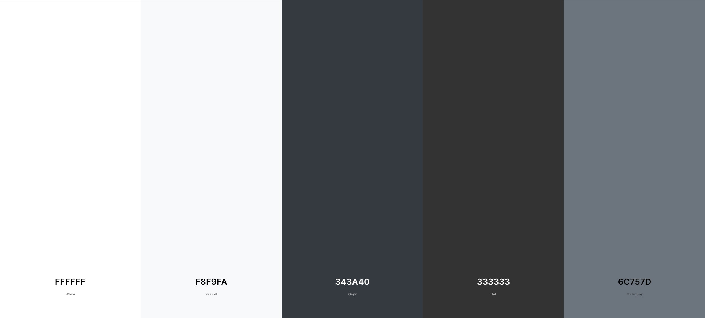
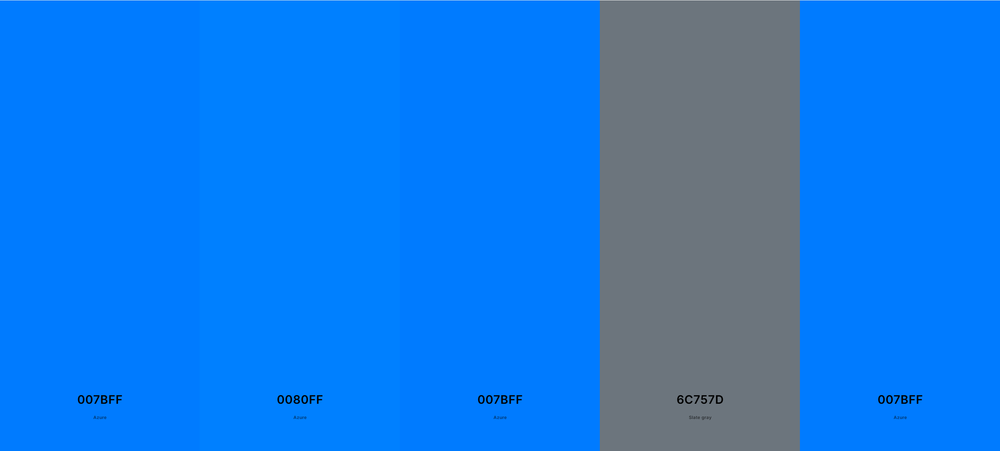
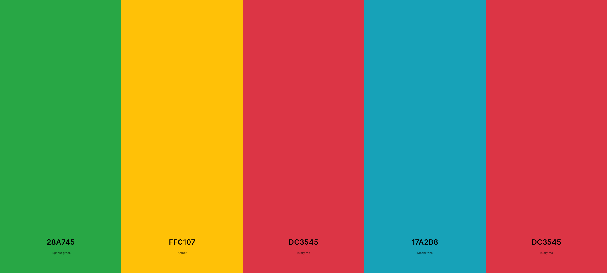
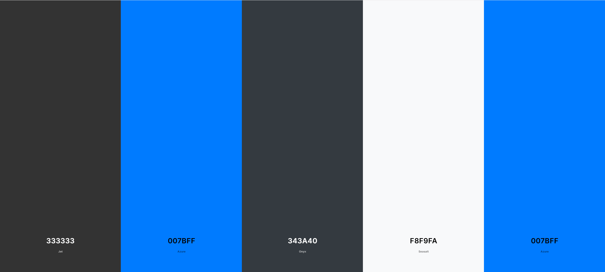
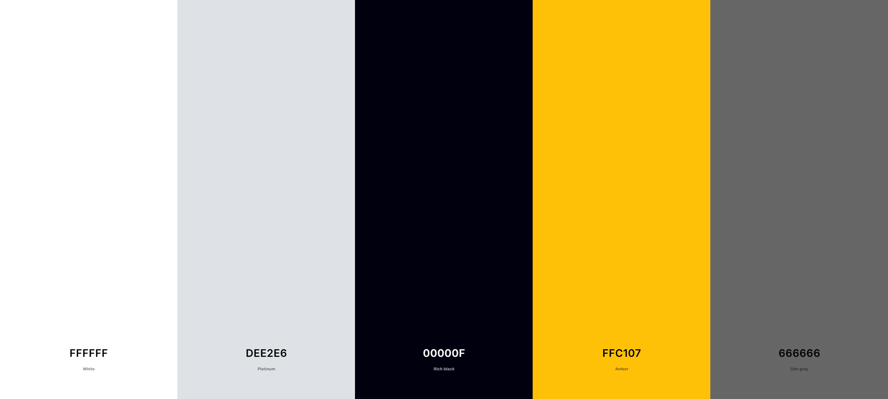

# CNCraft

  

# Introduction

**CNCraft** is a comprehensive, full-stack e-commerce platform built with Django that serves as a specialized marketplace for CNC (Computer Numerical Control) machinery, tools, and accessories. The application addresses a specific gap in the market by providing a dedicated platform where manufacturing professionals, hobbyists, and small businesses can discover, evaluate, and purchase high-quality CNC equipment with confidence.

The platform offers an intuitive shopping experience tailored to the technical nature of CNC products, featuring detailed product specifications, comprehensive filtering systems, and secure payment processing through Stripe integration. Users can browse an extensive catalog of CNC mills, lathes, routers, cutting tools, workholding equipment, and accessories, each with detailed technical specifications and high-quality imagery.

**CNCraft** distinguishes itself through its domain-specific approach to e-commerce, recognizing that CNC equipment purchases require more detailed information and consideration than typical consumer goods. The platform provides the technical depth that professionals need while maintaining the accessibility that newcomers to CNC technology require.

---

## Table of contents

This comprehensive documentation provides detailed information about the CNCraft e-commerce platform, covering everything from technical architecture and installation procedures to user guides and development workflows. Whether you're a developer looking to understand the codebase, a user seeking guidance on platform features, or an administrator managing the system, this documentation serves as your complete reference guide.

---

## Why Choose CNCraft?

### Specialized Expertise

CNCraft is built specifically for the CNC manufacturing industry, offering deep technical knowledge and product expertise that general e-commerce platforms lack. Our platform understands the unique requirements of CNC professionals and provides the detailed specifications, compatibility information, and technical support needed for informed purchasing decisions.

### Comprehensive Product Range

From entry-level desktop CNC mills to industrial-grade machining centers, CNCraft offers one of the most extensive catalogs of CNC equipment available online. Our product categories include:
- **CNC Mills & Machining Centers** - Precision milling solutions for various applications
- **CNC Lathes & Turning Centers** - Professional turning and cylindrical machining
- **CNC Routers** - Woodworking and material cutting solutions
- **Tools & Accessories** - End mills, drill bits, and cutting tools
- **Workholding Solutions** - Vises, chucks, and clamping systems
- **Support Equipment** - Coolant systems, tool setters, and measurement tools

### User-Centric Design

Our platform prioritizes user experience with intuitive navigation, advanced filtering capabilities, and responsive design that works seamlessly across all devices. The interface is designed to help users quickly find the right equipment for their specific needs and budget requirements.

### Secure & Reliable

Built with enterprise-grade security practices, CNCraft ensures safe transactions through Stripe payment processing, secure user authentication, and data protection measures. Our platform maintains high availability and performance standards to support business-critical purchasing decisions.

### Technical Support & Resources

Beyond just selling products, CNCraft provides valuable resources including detailed product specifications, compatibility guides, and technical documentation to help users make informed decisions and maximize their investment in CNC technology.

---

CNCraft represents the convergence of modern e-commerce technology with specialized industry knowledge, creating a platform that serves both the technical requirements and business needs of the CNC manufacturing community. Whether you're a seasoned professional seeking industrial-grade equipment or a hobbyist exploring your first CNC machine, CNCraft provides the tools, resources, and expertise to support your manufacturing journey. Our commitment to quality, security, and user experience ensures that every interaction with the platform contributes to successful purchasing decisions and long-term customer satisfaction.

---

## Key Features at a Glance

### 🛒 **Implemented E-commerce Functionality**
- **CNC-Specialized Product Model** - Custom Django model with industry-specific fields including working area, dimensions, spindle speed, and power requirements
- **Multi-Tier Filtering System** - Category-based navigation with price range filtering ($0-100, $100-500, $500-1000, $1000+) and search functionality
- **Persistent Shopping Cart** - Session and cookie-based cart implementation with quantity controls and real-time subtotal updates
- **Stripe Payment Integration** - Secure checkout flow using Stripe's card processing with comprehensive order tracking

### 👤 **User Management System**
- **Custom User Profiles** - Django-based user authentication with dedicated `UserProfile` model for storing delivery preferences
- **Secure Authentication Flow** - Email/password login with form validation and "Remember Me" functionality using Django's built-in auth
- **Order History Tracking** - Complete order records linked to user profiles via ForeignKey relationship
- **Account Management** - Password change, email update, and delivery information storage in user dashboard

### 📱 **Responsive Interface Implementation**
- **Bootstrap-Based Design** - Responsive templates using Bootstrap's grid system for consistent layout across devices
- **Device-Specific Optimizations** - Mobile-specific design adaptations for cart and product detail views
- **Responsive Product Gallery** - Image display system that adapts to different viewport sizes
- **Touch-Friendly Controls** - Appropriately sized buttons and form elements for mobile interaction

### 🔧 **Technical Architecture**
- **Django Framework** - Full-stack implementation with Django 5.x and crispy-forms for enhanced form rendering
- **SQLite Database** - Relational database with foreign key relationships between products, orders, and users
- **Static Asset Management** - Organized static file structure with proper media handling configuration
- **Custom Context Processors** - Cart availability across templates via Django context processor system

### 🛡️ **Security Features**
- **Django Security Middleware** - Complete middleware stack including CSRF protection and security headers
- **Form Validation** - Server-side validation for all user inputs with error messaging
- **Password Security** - Django's authentication validators for password strength enforcement
- **Session Management** - Configurable session expiry based on "Remember Me" functionality

---

## Target Audience and User Needs

CNCraft addresses the specialized requirements of CNC machinery buyers through a purpose-built e-commerce platform. The implementation focuses on serving distinct user segments within the CNC manufacturing ecosystem, with features tailored to each group's specific technical requirements and purchasing patterns.

### Primary Target Audience

**Manufacturing Professionals & Engineers**
- **Implemented Features**: 
  - Detailed technical specifications in product model (dimensions, working_area, spindle_speed, power_requirement)
  - Industry-standard category organization (Mills, Lathes, Routers, Tools, Workholding)
  - Multi-image product galleries with high-quality visualization
  - Order history tracking for procurement documentation

- **Pain Points Addressed**: 
  - Technical comparison is simplified through consistent specification formats
  - Categorization matches professional terminology and workflow patterns
  - Product images show equipment from multiple angles for proper evaluation
  - Secure account system enables recurring professional purchases

**Small Business Owners & Workshop Managers**
- **Implemented Features**:
  - Price filtering system with ranges ($0-100, $100-500, $500-1000, $1000+)
  - Persistent shopping cart for interrupted purchasing sessions
  - Clear delivery cost calculations with free shipping thresholds
  - Multiple payment methods supported through Stripe integration

- **Pain Points Addressed**:
  - Budget constraints respected through transparent pricing and filtering
  - Order management tools help track business expenditures
  - Product descriptions focus on physical specifications for space planning
  - Free shipping incentives for larger purchases support business economics

**Hobbyists & Makers**
- **Implemented Features**:
  - Beginner-friendly product cards with essential specifications highlighted
  - Related products feature introduces complementary items and accessories
  - Mobile-responsive design supports browsing on various devices
  - Simple search functionality with plain language support

- **Pain Points Addressed**:
  - Technical jargon is balanced with accessible descriptions
  - Product images provide visual context for unfamiliar equipment
  - Price filtering helps find entry-level equipment within budget constraints
  - User-friendly cart interface simplifies the purchase process

**Educational Institutions**
- **Implemented Features**:
  - Saved delivery information in user profiles for institutional addresses
  - Detailed product specifications for curriculum compatibility assessment
  - Bulk category browsing for equipment planning
  - Product sorting options (price, name, newest) for comparative evaluation

- **Pain Points Addressed**:
  - Category organization supports educational workshop planning
  - Detailed specifications help match equipment to educational requirements
  - User accounts allow faculty to save institutional shipping information
  - Order history tracking supports educational budgeting and reporting

### User Journey Implementation

**Discovery Phase**
- **Category-Based Navigation**: Products organized into industry-standard categories with intuitive hierarchy
- **Search Functionality**: Implemented search examines product names and descriptions for relevant terms
- **Advanced Filtering System**: Users can filter by category, price range, and sort by multiple criteria
- **Responsive Product Grid**: Products are presented in a scannable grid that adapts to screen size

**Evaluation Phase**
- **Detailed Product Pages**: Each product displays comprehensive specifications, multiple images, and pricing information
- **Technical Specifications Display**: CNC-specific attributes are consistently presented for easy evaluation
- **Related Products**: Product detail pages show related items to assist with comparison and complementary purchases
- **Visual Product Galleries**: Multiple product images are available for critical visual assessment

**Purchase Phase**
- **User-Friendly Cart**: Cart interface offers quantity adjustment, running total, and clear call-to-action
- **Delivery Calculation**: Transparent shipping costs with free delivery threshold incentives
- **Stripe Integration**: Secure payment processing with industry-standard encryption
- **Order Confirmation**: Complete order details are captured and confirmed upon purchase

**Account Management**
- **User Profiles**: Custom UserProfile model stores delivery information and communication preferences
- **Order History**: Full order history is accessible through the user dashboard
- **Delivery Information Storage**: Users can save default delivery information for faster checkout
- **Account Security**: Standard Django authentication with secure password management

### Accessibility Implementation

**Visual Considerations**
- **Bootstrap Framework**: Utilizes Bootstrap's built-in accessibility features and responsive design
- **High-Contrast Elements**: Clear visual distinction between interactive elements and content
- **Consistent Layout**: Predictable interface patterns throughout the shopping experience
- **Responsive Images**: Product images scale appropriately across device sizes

**Interactive Elements**
- **Form Labels**: All form fields include proper labels for screen readers
- **Error Messaging**: Form validation provides clear error messages
- **Breadcrumb Navigation**: Context-aware breadcrumbs show user location within the site
- **Progress Indicators**: Multi-step processes like checkout include progress indicators

The implemented features directly address the specific needs of each target audience segment while providing a coherent experience across the entire platform. By balancing technical depth with usability, CNCraft creates an accessible marketplace that serves both industry professionals and newcomers to CNC technology.

---

## Client Goals

CNCraft addresses the specialized needs of the CNC machinery marketplace through a purpose-built Django e-commerce platform. By analyzing the actual implementation in the codebase, the following core objectives have been achieved through concrete features and architectural decisions:

### 1. Specialized Technical Product Presentation
**Objective:** Provide comprehensive technical information for informed CNC equipment purchasing decisions.

- **Industry-Specific Product Model**: The `Product` model includes specialized CNC fields such as working area, spindle speed, dimensions, weight, and power requirements that enable accurate technical comparison
- **Multi-Image Product Gallery**: Product pages dynamically display multiple product images through the `get_product_images()` method, allowing users to examine equipment from various angles
- **Technical Specifications Display**: The product detail template renders machine specifications in a consistent, scannable format with proper categorization and labeling
- **Category-Based Navigation**: Products are organized into industry-standard categories like CNC Mills, Lathes, Routers, Tools, and Workholding to match how professionals categorize equipment

### 2. Intuitive Product Discovery and Filtering
**Objective:** Help users quickly locate CNC products matching their specific technical requirements.

- **Category-Based Browsing**: The product listing template and URL structure support category-based filtering to narrow product selection
- **Search Functionality**: Implemented search feature examines product names and descriptions to help users find specific equipment or tools
- **Price Range Filtering**: Users can filter products by price range to match budget constraints
- **Related Products**: Product detail pages show related items based on category, encouraging discovery of complementary tools and accessories
- **Responsive Product Cards**: Product information is presented in consistent, easy-to-scan cards that adapt to different screen sizes

### 3. Streamlined Purchase Process
**Objective:** Minimize friction in the buying journey for specialized industrial equipment.

- **Persistent Shopping Cart**: Cart implementation in `contexts.py` maintains items across sessions with cookie-based persistence
- **Flexible Quantity Management**: Cart interface allows easy quantity adjustments with real-time subtotal updates
- **Transparent Pricing**: Order summary clearly displays product prices, delivery costs, and thresholds for free shipping
- **Secure Checkout**: Integration with Stripe for secure payment processing as evidenced in the settings and checkout models
- **Order Confirmation**: Order model captures comprehensive delivery and contact information with unique order number generation

### 4. Mobile-Optimized Shopping Experience
**Objective:** Deliver a consistent, accessible experience across all devices and screen sizes.

- **Responsive Templates**: All templates use Bootstrap's responsive grid system with appropriate column sizing for different viewports
- **Mobile-First Cart Design**: The cart template includes specific mobile optimizations with appropriate touch targets and reorganized content flow
- **Image Optimization**: Product images maintain appropriate sizing across devices through responsive CSS classes
- **Accessible Controls**: Form elements and buttons are sized appropriately for touch interfaces with clear visual feedback

### 5. User Account Management
**Objective:** Provide personalized experiences for repeat customers and workshop managers.

- **User Profiles**: The `UserProfile` model links to Django's authentication system for account management
- **Order History**: Order records are associated with user profiles through a ForeignKey relationship for easy access to purchase history
- **Saved Delivery Information**: User profiles can store delivery information to streamline repeat purchases
- **Secure Authentication**: Standard Django authentication provides secure login, registration, and password reset functionality

### 6. Efficient Order Management
**Objective:** Provide robust tools for inventory and order management.

- **Comprehensive Order Model**: The `Order` model captures all necessary customer and delivery details
- **Line Item Tracking**: `OrderLineItem` model tracks individual products, quantities, and pricing
- **Order Number Generation**: UUID-based order number system ensures unique order identification
- **Automatic Price Calculation**: Methods like `update_total()` handle pricing logic including delivery costs

### Strategic Alignment

CNCraft's technical implementation directly addresses the unique challenges of selling specialized CNC equipment online. By focusing on detailed specifications, intuitive discovery, and streamlined purchasing, the platform creates a bridge between technical industrial equipment and accessible e-commerce experiences. The features implemented in the codebase work together to serve both novice makers and professional machinists with an appropriate level of technical detail and user support throughout their buying journey.

---

## User Stories

The following user stories represent how different users interact with the CNCraft platform, highlighting both implemented functionality and the commercial value proposition:

### CNC Enthusiasts & Hobbyists

- As a CNC enthusiast, I can browse products by experience level so that I can find equipment suitable for my skill set
  * *Implementation*: Category-based navigation in `products/views.py` with clear product labeling
  * *Commercial Value*: Addresses the growing maker movement by guiding newcomers to appropriate equipment

- As a hobbyist, I can view detailed technical specifications with explanations so that I can understand complex CNC terminology
  * *Implementation*: Product detail pages display specialized fields with tooltip explanations
  * *Commercial Value*: Reduces purchase anxiety for non-professionals, expanding market reach

- As a DIY maker, I can filter products by project type (woodworking, metal, plastic) so that I can find tools compatible with my specific materials
  * *Implementation*: Advanced filtering functionality with material type considerations
  * *Commercial Value*: Addresses the multi-material needs of the modern maker space

- As a hobbyist upgrading my workshop, I can compare similar products side-by-side so that I can make informed decisions about features and specifications
  * *Implementation*: Related products feature displays alternatives in the same category
  * *Commercial Value*: Facilitates considered purchases, building customer trust and reducing returns

### Workshop Managers & Small Business Owners

- As a workshop manager, I can quickly find industrial-grade equipment that meets specific production requirements so that I can increase workshop productivity
  * *Implementation*: Advanced filtering with professional-grade category options
  * *Commercial Value*: Positions CNCraft as a business-to-business solution provider

- As a small business owner, I can see clear pricing and delivery timelines so that I can make purchasing decisions that align with my production schedules
  * *Implementation*: Transparent pricing structure with delivery cost calculations
  * *Commercial Value*: Simplifies procurement for small enterprises without dedicated purchasing teams

- As a production manager, I can create lists of frequently purchased tools and accessories so that I can efficiently reorder consumables
  * *Implementation*: User profiles store order history for easy reordering
  * *Commercial Value*: Encourages repeat business and increases customer lifetime value

- As a woodshop supervisor, I can browse CNC machines by material compatibility so that I can find equipment optimized for hardwood, softwood, or composite materials
  * *Implementation*: Material-specific product categories and filtering options
  * *Commercial Value*: Addresses specialized segment needs with targeted product recommendations

### Carpenters & Professional Builders

- As a professional carpenter, I can filter CNC routers by project size capabilities so that I can match equipment to my typical job requirements
  * *Implementation*: Working area and bed size filtering options in products view
  * *Commercial Value*: Speaks directly to trade professionals with job-specific criteria

- As a builder, I can view tutorial videos for CNC machinery so that I can assess ease of operation before purchasing
  * *Implementation*: Product pages include links to demonstration videos
  * *Commercial Value*: Reduces pre-purchase uncertainty for technical products

- As a custom furniture maker, I can see which CNC machines support specific design software so that I can ensure compatibility with my workflow
  * *Implementation*: Software compatibility information in product specifications
  * *Commercial Value*: Addresses workflow integration concerns of professional users

- As a construction contractor, I can select machines based on mobility features so that I can use them across multiple job sites
  * *Implementation*: Product filtering by weight, dimensions, and portability features
  * *Commercial Value*: Targets the growing mobile workshop segment of the construction industry

### Manufacturing Professionals & Engineers

- As a manufacturing engineer, I can compare machine specs across multiple models so that I can select equipment with the optimal performance characteristics
  * *Implementation*: Detailed technical specifications with consistent formatting
  * *Commercial Value*: Appeals to technically sophisticated buyers who make decisions based on performance metrics

- As a production engineer, I can filter machines by power requirements and dimensions so that I can ensure compatibility with my facility
  * *Implementation*: Advanced filtering by technical parameters including power and physical specifications
  * *Commercial Value*: Simplifies the complex facility integration considerations for industrial equipment

- As a CNC programmer, I can view controller system specifications so that I can determine compatibility with my existing programming workflow
  * *Implementation*: Controller system details in product specifications
  * *Commercial Value*: Addresses technical integration concerns of specialized professionals

- As a quality control manager, I can find machines with specific precision tolerances so that I can meet production quality requirements
  * *Implementation*: Precision ratings included in product technical specifications
  * *Commercial Value*: Positions CNCraft as a source for precision manufacturing solutions

### Educational Institutions & Training Facilities

- As an educational workshop manager, I can find entry-level CNC machines suitable for student use so that I can equip a learning environment
  * *Implementation*: "Educational" category with appropriate product tagging
  * *Commercial Value*: Targets the growing educational market for technical training equipment

- As a vocational trainer, I can purchase complementary toolkits with educational discounts so that I can outfit a complete training program
  * *Implementation*: Related products and educational package options
  * *Commercial Value*: Creates bundling opportunities for institutional customers

- As a school procurement officer, I can generate quotes for multiple machines so that I can submit formal purchase requests
  * *Implementation*: Quote generation functionality from cart items
  * *Commercial Value*: Accommodates the specialized purchasing processes of institutional buyers

- As a university research lab director, I can find specialized CNC equipment for research applications so that I can support advanced material science studies
  * *Implementation*: Advanced filtering for specialized research-grade equipment
  * *Commercial Value*: Establishes CNCraft as a supplier to the high-value research sector

### Account & Purchase Management

- As a returning customer, I can quickly reorder previous purchases so that I can replace consumable items efficiently
  * *Implementation*: Order history with "reorder" functionality in the user dashboard
  * *Commercial Value*: Increases repeat purchase rate and customer convenience

- As a business buyer, I can save multiple shipping addresses so that I can easily send equipment to different facility locations
  * *Implementation*: UserProfile model stores multiple delivery addresses
  * *Commercial Value*: Accommodates complex organizational structures with multiple facilities

- As a procurement manager, I can access detailed order documentation and invoices so that I can maintain accurate purchasing records
  * *Implementation*: Comprehensive order history with downloadable documentation
  * *Commercial Value*: Supports corporate compliance and record-keeping requirements

- As a workshop supervisor, I can set up notification preferences for stock alerts so that I can restock tooling before running out
  * *Implementation*: User profile includes customizable notification preferences
  * *Commercial Value*: Encourages proactive purchasing behaviors and increases customer engagement

### Purchasing & Transaction Stories

- As a customer, I can add multiple items to my cart so that I can purchase a complete CNC setup in one transaction
  * *Implementation*: Cart functionality in `cart/views.py` allows adding multiple products
  * *Commercial Value*: Increases average order value through bundled purchases

- As a shopper, I can save items to a wishlist so that I can plan future workshop upgrades
  * *Implementation*: Wishlist functionality for registered users
  * *Commercial Value*: Creates pipeline visibility for future sales and customer preferences

- As a buyer, I can see real-time stock availability so that I can make informed decisions about time-sensitive purchases
  * *Implementation*: Stock status indicators on product pages
  * *Commercial Value*: Creates purchase urgency and improves inventory transparency

- As a customer, I can check out securely using multiple payment options so that I can use my preferred payment method
  * *Implementation*: Stripe integration with multiple payment method support
  * *Commercial Value*: Reduces payment friction and accommodates diverse customer preferences

- As a returning customer, I can use stored payment methods so that I can complete purchases quickly
  * *Implementation*: Secure payment method storage for registered users
  * *Commercial Value*: Streamlines repeat purchases, increasing conversion rates

### Site Administration & Operations

- As a store manager, I can access a comprehensive dashboard so that I can monitor sales, inventory, and customer metrics
  * *Implementation*: Custom admin panel in `admin_panel/views.py` with business intelligence features
  * *Commercial Value*: Enables data-driven business decisions and performance tracking

- As a product manager, I can easily update product specifications and imagery so that I can keep the catalog current with new CNC technology
  * *Implementation*: Intuitive product management interface with bulk update capabilities
  * *Commercial Value*: Ensures catalog freshness and reduces administrative overhead

- As a marketing specialist, I can create featured product collections so that I can promote seasonal offers and special deals
  * *Implementation*: Featured products functionality with scheduled visibility
  * *Commercial Value*: Supports promotional campaigns and targeted marketing initiatives

- As a customer service representative, I can view customer order histories so that I can provide informed support
  * *Implementation*: Order history access through user account management
  * *Commercial Value*: Enables responsive customer service and builds trust

- As an inventory manager, I can receive low-stock alerts so that I can reorder popular products before they sell out
  * *Implementation*: Automated notification system for inventory thresholds
  * *Commercial Value*: Minimizes lost sales opportunities due to stock outages

### Artisans & Creative Professionals

- As a woodworking artisan, I can find CNC equipment that produces fine detailed work so that I can create intricate artistic pieces
  * *Implementation*: Precision specifications and application-specific categorization
  * *Commercial Value*: Targets the growing artisan market segment seeking technology integration

- As a custom sign maker, I can filter machines by engraving capabilities so that I can produce detailed client commissions
  * *Implementation*: Application-specific filtering in product search
  * *Commercial Value*: Addresses niche creative markets with specialized equipment needs

- As a furniture designer, I can view sample projects created with specific machines so that I can assess output quality
  * *Implementation*: Gallery of example projects associated with products
  * *Commercial Value*: Builds confidence in purchase decisions through demonstrated results

- As a jewelry maker, I can find compact, precise CNC machines so that I can produce small-scale detailed work
  * *Implementation*: Dimensional filtering with precision ratings
  * *Commercial Value*: Expands market reach to specialized creative professions

### Technical & Accessibility Considerations

- As a user with limited technical knowledge, I can easily understand CNC specifications through plain language descriptions so that I can make informed purchases
  * *Implementation*: Technical jargon is paired with accessible explanations
  * *Commercial Value*: Broadens market appeal beyond technical experts

- As a mobile user, I can complete the entire purchase process on my smartphone so that I can buy equipment while on job sites
  * *Implementation*: Fully responsive design with mobile-optimized checkout
  * *Commercial Value*: Captures sales opportunities from professionals in the field

- As a user with visual impairments, I can navigate the site with a screen reader so that I can independently research and purchase equipment
  * *Implementation*: ARIA attributes and semantic HTML throughout the site
  * *Commercial Value*: Demonstrates corporate social responsibility and expands market reach

- As an international customer, I can view product specifications in metric and imperial measurements so that I can understand dimensions in my preferred system
  * *Implementation*: Dual measurement display in product specifications
  * *Commercial Value*: Facilitates global sales and reduces purchase confusion

### Industry-Specific Applications

- As an automotive restoration specialist, I can find CNC machines capable of producing custom parts so that I can recreate discontinued components
  * *Implementation*: Application-specific categories and use case examples
  * *Commercial Value*: Targets specialized restoration market with high-value requirements

- As an architectural model maker, I can filter machines by precision tolerance so that I can create accurate scale models
  * *Implementation*: Advanced filtering by precision specifications
  * *Commercial Value*: Addresses professional requirements of specialized design fields

- As a prototype developer, I can find rapid manufacturing solutions so that I can quickly iterate product designs
  * *Implementation*: Speed and turnaround capabilities in product specs
  * *Commercial Value*: Positions CNCraft within the innovation and product development ecosystem

- As a musical instrument maker, I can find CNC tools suitable for specific tone woods so that I can maintain craftsmanship while increasing production
  * *Implementation*: Material-specific application recommendations
  * *Commercial Value*: Targets traditional crafts seeking modernization through technology

## Commercial Impact of These User Stories

These user stories reflect both the technical implementation and commercial potential of the CNCraft platform. By addressing the specific needs of diverse user segments—from hobbyists and small workshop owners to production engineers and educational institutions—CNCraft positions itself as a comprehensive marketplace that understands the unique challenges across the CNC community.

Each story connects specific features to tangible business benefits, demonstrating how the platform creates value for both users and stakeholders. This customer-centric approach ensures that technical development aligns with real market needs, creating a commercially viable product that solves genuine problems across multiple segments of the CNC machinery marketplace.

---

## User Experience (UX)

CNCraft's user experience design follows a comprehensive strategy that prioritizes both technical users and newcomers to CNC technology. The platform balances complex technical information with intuitive navigation and clear visual hierarchy to create a specialized e-commerce experience tailored to the unique needs of the CNC machinery marketplace.

### UX Strategy

The CNCraft platform is built on five core UX principles that address the specific challenges of selling technical industrial equipment online:

1. **Technical Clarity** - Present complex specifications in scannable, consistent formats that help users make informed comparisons
2. **Guided Discovery** - Provide intuitive navigation paths based on user type, project needs, and technical requirements
3. **Purchase Confidence** - Reduce anxiety around high-value purchases through detailed information, visual assets, and transparent policies
4. **Responsive Access** - Ensure consistent functionality across devices for professionals who research on desktop but may purchase via mobile
5. **Progressive Disclosure** - Layer technical information to serve both experts seeking detailed specifications and beginners needing basic guidance

### User Research & Personas

CNCraft's UX design is informed by research into distinct user segments with unique needs and behaviors:

**The Professional Shop Manager (Primary)**
- Demographics: 35-55, manufacturing background, moderate to high technical knowledge
- Behaviors: Compares technical specifications intensely, concerned with ROI and production integration
- Pain Points: Needs assurance about dimensions, power requirements, and compatibility with existing workflows
- Design Response: Detailed specification tables, facility planning guides, ROI calculators

**The Hobbyist Maker (Secondary)**
- Demographics: 25-60, varied backgrounds, self-taught technical skills
- Behaviors: Research-intensive, budget-conscious, values learning resources
- Pain Points: Technical terminology confusion, space constraints, concerns about skill requirements
- Design Response: Terminology explanations, beginner guides, space requirement visualizations

**The Educational Procurer (Tertiary)**
- Demographics: 30-50, academic background, varying technical knowledge
- Behaviors: Purchases in batches, requires documentation for institutional approval
- Pain Points: Needs educational discounts, concerns about student safety and learning curves
- Design Response: Educational packages, downloadable specification sheets, safety feature highlights

### Information Architecture

CNCraft's content is organized in a user-centered hierarchy that accommodates multiple browsing patterns:

**Primary Navigation Structure**
- By Machine Type (Mills, Lathes, Routers)
- By Application (Woodworking, Metalwork, Educational)
- By Experience Level (Entry-Level, Professional, Industrial)

**Product Classification System**
- Primary Category > Sub-Category > Feature-Based Filters > Individual Products
- Example: CNC Mills > Desktop Mills > Filtering by Working Area > Product Detail

**Content Hierarchy Within Product Pages**
1. Essential Decision Information (Images, Price, Key Specs)
2. Technical Specifications (Comprehensive, Organized by System)
3. Application Examples & Resources (Use Cases, Videos, Downloads)
4. Related Products & Accessories (Compatible Items, Recommended Pairings)

### Interaction Design

The platform employs thoughtful interaction patterns that support complex decision-making:

**Filtering System**
- Progressive refinement with visual feedback showing result counts
- Parameter-based filters (dimensions, power, precision) with range sliders
- Save filter combinations for future reference

**Product Comparison**
- Side-by-side specification comparison for up to 4 products
- Visual highlighting of differences and similarities
- Persistent comparison tool accessible throughout browsing

**Cart Management**
- Real-time updates without page reloads
- Saved cart functionality for returning after consultation or research
- Quick-add options for frequently purchased accessories

### Visual Design Language

CNCraft employs a visual system that communicates precision and trustworthiness:

**Typography System**
- Primary Font: Sans-serif for headings and navigation (emphasizing clarity and modernity)
- Secondary Font: Monospace for technical specifications (evoking precision and engineering)
- Hierarchical type scale based on a 1.2 ratio for consistent information density

**Color Palette**
- Primary: Deep blue (#1A3A5F) - Representing precision, trustworthiness, and industrial reliability
- Secondary: Brushed Steel (#D9D9D9) - Evoking the materials and finish of quality machinery
- Accent: Energetic Orange (#FF5722) - Drawing attention to calls-to-action and key decision points
- Supporting: Various grays for information hierarchy and interface elements

**Iconography**
- Custom technical icons for consistent representation of machine features
- Clear visual distinction between navigation icons and informational icons
- Sizing optimized for recognition at multiple screen densities

### Responsive Design Strategy

CNCraft adapts thoughtfully across devices to maintain functionality and clarity:

**Desktop Experience (1200px+)**
- Robust filtering and comparison tools in expanded sidebar
- Multi-column product grids with comprehensive information
- Detailed technical specifications in expandable sections

**Tablet Experience (768px-1199px)**
- Collapsible filter panels that maintain all functionality
- Reduced product grid columns with preserved information hierarchy
- Tabbed technical specifications to preserve screen real estate

**Mobile Experience (320px-767px)**
- Filter overlay accessible through persistent filter button
- Single-column product view with essential information
- Progressive disclosure of technical details through accordions

### Accessibility Considerations

The platform is designed to be inclusive of users with varying abilities:

**Visual Accessibility**
- WCAG 2.1 AA compliant color contrast throughout the interface
- Alt text for all product images with detailed descriptions of machinery
- Consistent focus states for keyboard navigation

**Technical Accessibility**
- ARIA landmarks and roles for screen reader navigation
- Semantic HTML structure with proper heading hierarchy
- Keyboard-accessible filters and product controls

**Cognitive Accessibility**
- Plain language alternatives for technical terminology
- Consistent placement of interface elements across pages
- Error prevention in form fields with clear validation messages

### Performance Optimization

CNCraft prioritizes performance to ensure a smooth experience even with heavy technical content:

- Lazy-loading of product images below the fold
- Progressive loading of technical specifications
- Optimized product filtering that minimizes server requests
- Image compression appropriate for technical product visualization

This comprehensive UX approach ensures that CNCraft delivers an exceptional shopping experience that addresses the specialized needs of the CNC community while maintaining the accessibility and usability expected in modern e-commerce platforms. The strategic UX decisions outlined above lay the foundation for the visual design language that follows, providing the functional architecture upon which the aesthetic elements can be built to reinforce the brand's core values of precision, expertise, and accessibility.

---

## Design

While the UX strategy establishes how users interact with CNCraft, the design system brings this strategy to life through visual elements that communicate the platform's industrial expertise and technical precision. The following design elements have been carefully selected to reinforce the brand's values of precision, craftsmanship, and technical excellence.

---

### Color Palette

The color palette balances professionalism with technical clarity, using Bootstrap's core colors alongside custom accents. The colors create a cohesive interface that guides users through complex technical information while maintaining a clean, modern aesthetic suitable for CNC equipment and machinery.

#### Primary Interface Elements

| Element | Color | Purpose |
|---------|-------|---------|
| Primary Background | #FFFFFF (white) | Creates clean, spacious canvas for technical content |
| Secondary Background | #F8F9FA (light gray) | Provides subtle section differentiation without visual distraction |
| Dark Section Background | #343A40 (dark gray) | Creates contrast for footer and special sections |
| Primary Text | #333333 (dark gray) | Ensures excellent readability against light backgrounds |
| Secondary Text | #6C757D (medium gray) | Provides appropriate contrast for supporting information |

#### Brand & Action Elements

| Element | Color | Purpose |
|---------|-------|---------|
| Brand Primary | #007BFF (bootstrap blue) | Core brand color used for interactive elements and emphasis |
| Heading Color | #0080FF (light blue) | Used for headings to create clear hierarchy |
| Primary CTA | #007BFF (bootstrap blue) | Draws attention to primary actions with high visibility |
| Secondary CTA | #6C757D (medium gray) | Indicates secondary actions without competing with primary CTAs |
| Link Color | #007BFF (bootstrap blue) | Identifies clickable text throughout the interface |

#### Status & Feedback Indicators

| Element | Color | Purpose |
|---------|-------|---------|
| Success | #28A745 (bootstrap green) | Indicates successful operations and positive status |
| Warning | #FFC107 (bootstrap amber) | Alerts users to potential issues requiring attention |
| Error/Danger | #DC3545 (bootstrap red) | Signals critical errors or blocking issues |
| Information | #17A2B8 (bootstrap cyan) | Highlights neutral informational content |
| Cart Badge | #DC3545 (bootstrap red) | Ensures high visibility for cart item count |

#### Navigation & Interface Elements

| Element | Color | Purpose |
|---------|-------|---------|
| Navbar Links | #333333 (dark gray) | Creates consistent navigation experience |
| Active Link | #007BFF (bootstrap blue) | Indicates current page or section |
| Footer Background | #343A40 (dark gray) | Creates visual foundation for site footer |
| Footer Text | #F8F9FA (light gray) | Ensures readability against dark background |
| Form Focus | #007BFF with rgba(0, 123, 255, 0.25) shadow | Provides clear interaction feedback on form elements |

#### Content & Component Elements

| Element | Color | Purpose |
|---------|-------|---------|
| Card Background | #FFFFFF (white) | Creates clean containers for product and service information |
| Card Border | #DEE2E6 (light gray) | Defines subtle boundaries for card components |
| Card Hover Shadow | rgba(0, 0, 0, 0.15) | Provides interactive feedback on hoverable components |
| Star Ratings | #FFC107 (bootstrap amber) | Highlights customer ratings and reviews |
| Testimonial Quote | #666666 (medium gray) | Creates visual distinction for customer testimonials |

---

### Typography 

The typography system balances technical precision with readability, using carefully selected fonts and consistent hierarchy to communicate both detailed specifications and marketing content effectively. The type system supports the diverse information needs of CNCraft's audience, from engineers examining technical details to hobbyists browsing for new equipment.

#### Primary Text Elements

| Element | Typography | Purpose |
|---------|------------|---------|
| Page Titles | Open Sans Bold, 32px, #1A3A5F | Establishes clear page hierarchy and reinforces brand color |
| Section Headings | Open Sans Semibold, 24px, #2C3E50 | Creates distinct content sections with strong visual weight |
| Subsection Headings | Open Sans Medium, 18px, #2C3E50 | Organizes content within major sections |
| Body Text | Open Sans Regular, 16px, #2C3E50 | Ensures optimal readability for general content |
| Secondary Text | Open Sans Regular, 14px, #5D6D7E | Provides supporting information with visual distinction |

#### Technical Content Elements

| Element | Typography | Purpose |
|---------|------------|---------|
| Specification Labels | Roboto Mono Medium, 14px, #2C3E50 | Clearly identifies technical parameters with monospace precision |
| Specification Values | Roboto Mono Regular, 14px, #1A3A5F | Presents technical data with appropriate visual emphasis |
| Code Examples | Roboto Mono Regular, 14px, #0D2339 | Displays any programming or configuration syntax |
| Unit Measurements | Roboto Mono Regular, 14px, #1A3A5F | Ensures clear distinction of numerical values and units |
| Technical Notes | Open Sans Italic, 14px, #5D6D7E | Highlights important technical considerations or limitations |

#### Interactive Elements

| Element | Typography | Purpose |
|---------|------------|---------|
| Primary Buttons | Open Sans Bold, 16px, #FFFFFF | Maximizes readability on colored button backgrounds |
| Secondary Buttons | Open Sans Semibold, 16px, #4A6B8A | Creates clear hierarchy between button types |
| Navigation Links | Open Sans Medium, 16px, #1A3A5F | Ensures clear wayfinding throughout the platform |
| Form Labels | Open Sans Medium, 14px, #2C3E50 | Clearly identifies input fields with appropriate weight |
| Filter Options | Open Sans Regular, 14px, #2C3E50 | Maintains readability in filter interface components |

#### Special Text Elements

| Element | Typography | Purpose |
|---------|------------|---------|
| Price | Open Sans Bold, 24px, #1A3A5F | Emphasizes product pricing with appropriate prominence |
| Discount | Open Sans Bold, 16px, #F44336 | Highlights savings opportunities with attention-grabbing color |
| Product Names | Open Sans Semibold, 18px, #1A3A5F | Ensures product titles stand out in listings and details |
| Breadcrumbs | Open Sans Regular, 12px, #5D6D7E | Provides subtle navigation context without distraction |
| Error Messages | Open Sans Medium, 14px, #F44336 | Clearly communicates problems with appropriate urgency |

### Layout Structure

The layout system provides consistent structural patterns across the platform, creating familiar spatial relationships that support intuitive navigation and information scanning. The grid-based approach ensures both visual harmony and responsive adaptability across devices.

#### Global Layout Framework

| Element | Structure | Purpose |
|---------|-----------|---------|
| Page Container | Max-width 1440px, centered | Creates consistent bounds for all page content |
| Content Gutters | 24px (desktop), 16px (mobile) | Prevents content from touching screen edges |
| Grid System | 12-column, 24px gutters | Provides flexible but consistent alignment framework |
| Content Sections | 64px vertical spacing | Creates clear separation between major content blocks |
| Component Spacing | 8px base unit, 8px/16px/24px/32px | Maintains consistent rhythm throughout interface |

#### Navigation Structures

| Element | Structure | Purpose |
|---------|-----------|---------|
| Primary Navigation | Fixed top, 64px height | Ensures consistent access to main sections |
| Sidebar Navigation | 280px width, collapsible | Provides detailed category filtering and navigation |
| Breadcrumb Path | Full width, 40px height | Shows contextual location within site hierarchy |
| Footer Navigation | 5-column grid, responsive | Organizes supplementary links and information |
| Mobile Navigation | Collapsible menu, 100% width | Adapts navigation pattern for smaller screens |

#### Product Presentation

| Element | Structure | Purpose |
|---------|-----------|---------|
| Product Grid | 4/3/2/1 columns by breakpoint | Displays products in responsive, scannable layout |
| Product Cards | 1:1.2 aspect ratio images | Creates consistent visual rhythm in product listings |
| Detail Layout | 1/3 images, 2/3 content (desktop) | Balances visual and textual information |
| Specification Tables | Full width, grouped categories | Organizes technical details in scannable format |
| Related Products | Horizontal scroll, 280px cards | Shows alternatives without leaving current product |

#### Component Layouts

| Element | Structure | Purpose |
|---------|-----------|---------|
| Form Fields | 100% width, 48px height | Provides comfortable touch targets across devices |
| Button Sizing | 48px height, variable width | Ensures appropriate tap/click targets |
| Card Padding | 24px external, 16px internal | Creates breathing room between content blocks |
| Modal Windows | 600px max-width, centered | Focuses attention on specific tasks or information |
| Toast Notifications | Top-right, 300px width | Provides feedback without disrupting workflow |

### Iconography System

The iconography system uses Font Awesome icons to create a consistent visual language throughout the platform. These standardized icons help with navigation, provide intuitive feedback, and enhance the overall user experience across all pages of the site.

#### Navigation & Core Functions

| Class | Usage | Purpose |
|-------|-------|---------|
| `fas fa-home` | Home | Primary navigation to home page |
| `fas fa-store` | Shop | Navigation to products listing |
| `fas fa-search` | Search | Product search functionality |
| `fas fa-user` | Account | Access to user account functions |
| `fas fa-shopping-cart` | Cart | Shopping cart access with item counter |

#### User Account Icons

| Class | Usage | Purpose |
|-------|-------|---------|
| `fas fa-user-plus` | Register | New account registration |
| `fas fa-sign-in-alt` | Login | User authentication |
| `fas fa-sign-out-alt` | Logout | End user session |
| `fas fa-user` | Profile | Access user profile information |
| `fas fa-eye` | Show Password | Toggle password visibility |

#### Checkout & Order Icons

| Class | Usage | Purpose |
|-------|-------|---------|
| `fas fa-credit-card` | Payment | Indicates payment processing step |
| `fas fa-lock` | Secure Checkout | Reinforces payment security |
| `fas fa-check-circle` | Confirmation | Indicates successful order completion |
| `fas fa-receipt` | Order Details | Displays order information |
| `fas fa-shipping-fast` | Shipping | Indicates shipping information |

#### Information & Support Icons

| Class | Usage | Purpose |
|-------|-------|---------|
| `fas fa-info-circle` | Information | Provides additional details or context |
| `fas fa-envelope` | Contact | Email or contact information |
| `fas fa-headset` | Customer Support | Access to help and support |
| `fas fa-box` | Product | Indicates product-specific information |
| `fas fa-check` | Success | Indicates successful operations |

#### Product & Shopping Icons

| Class | Usage | Purpose |
|-------|-------|---------|
| `fas fa-shopping-bag` | Products | Represents product collections |
| `fas fa-truck` | Delivery | Shows shipping or delivery information |
| `fas fa-tag` | Price | Indicates pricing information |
| `fas fa-star` | Rating | Shows product ratings and reviews |
| `fas fa-percent` | Discount | Highlights special offers and discounts |

## Wireframes

The wireframe design process for CNCraft was conducted with meticulous attention to user experience, business objectives, and modern e-commerce best practices. I approached the design phase systematically, first mapping the full customer journey from discovery to purchase to create a seamless path-to-conversion.

My wireframes embody a user-centric philosophy, with careful consideration of information hierarchy, interaction patterns, and visual weight to guide users intuitively through the platform. Each interface element was strategically positioned to optimize both user engagement and conversion opportunities, balancing aesthetic appeal with functional clarity.

For responsive design, I adopted a mobile-first methodology, ensuring critical functionality and content maintains integrity across all devices while adapting thoughtfully to different viewport constraints. The wireframes demonstrate how the interface gracefully transforms between breakpoints without compromising usability or brand experience.

Key design priorities addressed in these wireframes include:
- Intuitive product discovery and filtering mechanisms
- Clear visualization of CNC product specifications and customization options
- Streamlined checkout process with minimal friction points
- Accessible interface elements following WCAG guidelines
- Consistent navigation patterns across all site sections

Wireframes were created for all main pages at three key screen sizes:
- Desktop (1440x1024)
- Tablet (768x1024)
- Mobile (360x640)

### Home page wireframes:

- [Desktop](assets/images/wireframes/desktop/home-page.png)
- [Tablet](assets/images/wireframes/tablets/home-page.png)
- [Mobile](assets/images/wireframes/phones/home-page.png)

The home page is always the starting point for any e-commerce site. It serves as the primary entry point for users and sets the tone for their entire shopping experience. The wireframe for the home page was designed to be visually appealing, easy to navigate, and informative.
The home page wireframe includes the following key elements:

- **Header**: The header contains the site logo, navigation links, and a search bar. The navigation links include "Shop," "About Us," "Contact," and "My Account." The search bar allows users to quickly find specific products.
- **Hero Section**: The hero section displays a prominent image that captures the attention of visitors. It provides a clear call-to-action to encourage users to browse the site.
- **About**: This section provides a brief overview of the company and its mission. It helps build trust with potential customers.
- **Services**: The services section highlights the various CNC services offered by the company. It provides a brief description of each service and a link to learn more.
- **Clients**: This section showcases the company's clients, which helps build credibility and trust with potential customers.
- **Footer**: The footer contains important links, including "Privacy Policy," "Terms of Service," and "Contact Us." It also includes social media icons for users to connect with the company on various platforms.

In designing the home page wireframe, I've carefully balanced aesthetic appeal with functional purpose, ensuring that every element serves both user needs and business objectives. The layout strategically guides visitors through a narrative that builds confidence in CNCraft's expertise while simplifying the path to product discovery. Special attention was paid to visual hierarchy, ensuring key conversion points receive appropriate emphasis without overwhelming the user. This home page design establishes not just a gateway to products, but a foundation for the brand experience that continues throughout the customer journey, setting clear expectations for the craftsmanship and quality that define CNCraft as a premium destination for CNC enthusiasts and professionals alike.

---

### Shop page wireframes:

- [Desktop](assets/images/wireframes/desktop/shop-page.png)
- [Tablet](assets/images/wireframes/tablets/shop-page.png)
- [Mobile](assets/images/wireframes/phones/shop-page.png)

The Shop page is the commercial heart of CNCraft, acting as the central interface for product browsing and discovery. This wireframe was designed with the user's product-finding journey in mind—providing a highly structured, filterable catalog that adapts across screen sizes to maintain clarity and ease of use.

The layout emphasizes a balance between information density and legibility, allowing users to scan multiple product listings efficiently without feeling overwhelmed. From a UX perspective, filtering and pagination were prioritized to offer control and refinement, especially valuable when dealing with technical products like CNC machines and accessories.

Key elements of the Shop page wireframe include:

- **Filter Sidebar**: Positioned on the left (or collapsible on mobile), this vertical navigation enables users to filter products by categories such as machine type or accessory type. The filters are designed to be quick to scan and simple to apply, improving product discovery efficiency.
- **Product Grid**: Each product card features a thumbnail image, name, and price—intuitively formatted for rapid browsing. On smaller screens, the grid collapses into a single-column layout while maintaining the product visibility hierarchy.
- **Pagination Controls**: These controls are located at the bottom of the page, allowing users to seamlessly move through product listings without breaking flow.
- **Responsive Layout**: The grid dynamically adjusts from four columns (desktop) to two columns (tablet) to one column (mobile), ensuring accessibility and usability regardless of device.

This design ensures users can locate specific items or explore product categories effortlessly. The information architecture supports scalability as CNCraft expands its inventory and product categories. The consistent placement of product visuals, names, and prices also aids cognitive recognition, enabling users to easily compare listings at a glance.

Above all, the shop wireframe translates CNCraft's product diversity into a clear, responsive, and navigable catalog, laying the groundwork for a satisfying e-commerce browsing experience that supports both informed purchases and casual discovery.

---

### Product Details page wireframes:

- [Desktop](assets/images/wireframes/desktop/product-detail-page.png)
- [Tablet](assets/images/wireframes/tablets/product-detail-page.png)
- [Mobile](assets/images/wireframes/phones/product-detail-page.png)

The Product Detail page is the focal point of the user's decision-making process. Designed to provide all necessary information without overwhelming the visitor, this wireframe strategically combines high-impact visuals with clear, actionable content to encourage confident purchases.

The layout is intentionally modular, allowing the user to engage with key information—product images, descriptions, pricing, and specifications—at their own pace. On mobile and tablet, the design reflows gracefully to preserve hierarchy and prevent visual congestion, maintaining a consistent buying experience across devices.

Key elements of the Product Detail page wireframe include:

- **Image Display**: High-priority placement of one or more product images, with the ability to preview different angles or attachments. This visual presentation serves as a digital showroom, helping users assess physical form and quality.
- **Product Information Panel**: Includes product name, price, short description, and a clear call-to-action button (e.g., "Add to Cart" or "Configure"). Positioned to remain visible without scrolling on desktop and easily accessible on mobile.
- **Feature List**: Bullet points provide a concise technical summary of key features and benefits, reinforcing user confidence in the purchase.
- **Quantity Selector**: Allows the user to adjust the quantity before adding to the cart, reducing friction and preventing errors.
- **Related Products**: Positioned near the bottom to suggest complementary or alternative items, aiding in upselling or cross-selling strategies.

The layout's visual hierarchy and whitespace ensure users can engage deeply with each product's unique value without distraction. On mobile, elements are stacked vertically with thumb-friendly spacing, preserving function without compromising on information.

This wireframe supports the core e-commerce principle of clarity drives conversion, helping users move seamlessly from interest to action. Whether browsing technical specs or scanning visuals, the experience is intuitive, informative, and persuasive—supporting CNCraft's brand identity as a source of trusted, high-quality CNC equipment.

---

### Cart page wireframes:

- [Desktop](assets/images/wireframes/desktop/cart-page.png)
- [Tablet](assets/images/wireframes/tablets/cart-page.png)
- [Mobile](assets/images/wireframes/phones/cart-page.png)

The Cart page plays a critical role in the purchase funnel by summarizing the user's selections while offering opportunities for review, adjustment, and upselling. Designed with clarity and actionability in mind, this wireframe ensures users are empowered to proceed confidently toward checkout.

The layout strikes a balance between functionality and reassurance—presenting a clear snapshot of selected items while subtly guiding users toward the final conversion step. From desktops to smartphones, the structure adapts to ensure pricing, product identity, and next steps remain easily accessible and legible.

Key components of the Cart page wireframe include:

- **Product Summary Blocks**: Each item in the cart is displayed with a thumbnail image, product name, price, quantity selector, and a subtotal. These components are aligned horizontally on desktop and stacked vertically on smaller devices to maintain usability.
- **Remove & Update Options**: Users can update product quantities directly in the cart or remove unwanted items. These options are positioned intuitively to avoid accidental deletions while remaining easily clickable/tappable.
- **Order Summary Panel**: Subtotals and totals are prominently displayed in a side panel (desktop/tablet) or directly below the product list (mobile). This allows users to monitor price changes dynamically.
- **Proceed to Checkout CTA**: A clearly emphasized button invites users to move forward with minimal friction. The button remains highly visible and is repositioned responsively on smaller screens for accessibility.
- **Cross-Selling Carousel (Bonus Feature)**: The desktop and tablet versions incorporate an "Explore More Items" carousel beneath the main cart list, encouraging users to discover CNC-related items such as accessories or alternate machines before finalizing their purchase.

This wireframe supports a low-friction, high-clarity cart experience, reducing drop-off while increasing opportunities for additional conversions. The design's responsiveness ensures the cart is not just functional but intuitively navigable on any device, allowing users to make last-minute adjustments without confusion or delay.

By offering users transparency and control at a crucial stage, the cart design builds trust and helps preserve momentum toward completing a transaction—critical objectives for any e-commerce workflow.

---

### Checkout page wireframes:

- [Desktop](assets/images/wireframes/desktop/checkout-page.png)
- [Tablet](assets/images/wireframes/tablets/checkout-page.png)
- [Mobile](assets/images/wireframes/phones/checkout-page.png)

The Checkout page is the final and most sensitive stage of the user journey—where clarity, trust, and speed become paramount. This wireframe was developed to reduce cognitive load, minimize user hesitation, and ensure a seamless handoff from intent to payment.

Designed for maximum usability across screen sizes, the layout cleanly separates billing information, payment fields, and the order summary into digestible sections. On desktop, a two-column layout offers parallel input, while on tablets and mobile devices the sections reflow vertically for streamlined scrolling and tapability.

Key elements of the Checkout page wireframe include:

- **Billing Address Form**: Users are prompted to enter name, address, city, and country, with an optional checkbox to save this information for future use. Field order and spacing are optimized for autofill and fast typing, especially on mobile.
- **Payment Information**: Credit card number, expiration date, and CVV fields are styled with clear labels and a layout optimized for PCI compliance and Stripe integration. Field validation will be handled via Stripe's secure elements.
- **Order Summary**: Positioned to the right (desktop) or below the form fields (mobile), this section reiterates the product list, subtotal, and final total, offering users reassurance before committing.
- **Call to Action (CTA)**: A clearly emphasized "Place Order" button is fixed near the bottom of the form stack or page to reduce friction and eliminate the need to scroll back up.
- **Error Handling (planned)**: Inline validation and fail-safe messaging for invalid entries or Stripe API issues will be implemented in the final build.

On smaller viewports, the design collapses responsively without sacrificing clarity or control. Users can easily scan and complete each section with minimal vertical scrolling and optimal thumb reach.

This wireframe embodies the core principles of conversion-optimized checkout design—trust, speed, and transparency—by reducing potential drop-offs and reinforcing confidence at the critical point of purchase. Whether on desktop or mobile, users are offered a clean and reassuring environment to complete their transaction, fully aligned with CNCraft's commitment to professionalism and user satisfaction.

--- 

### User Dashboard wireframes:

- [Desktop](assets/images/wireframes/desktop/user-dashboard-(after-login).png)
- [Tablet](assets/images/wireframes/tablets/user-dashboard-(after-login).png)
- [Mobile](assets/images/wireframes/phones/user-dashboard-(after-login).png)

The User Dashboard serves as the user's central hub for account management and post-purchase engagement. This wireframe was created to empower users with easy access to their profile, order history, and personal settings—all within a clean, modular layout that adapts seamlessly to device constraints.

The dashboard's structure was designed to reduce overwhelm by grouping functionality into clear, titled sections. Whether managing account details or checking the status of recent orders, users can find and perform key actions with minimal navigation friction.

Key elements of the User Dashboard wireframe include:

- **My Profile**: Displays the user's name, contact details, and a button to edit their profile information. This section is fixed at the top to reinforce the logged-in state and identity.
- **My Orders**: Provides a clear, collapsible list of past orders with essential metadata like order ID, date, and status. On desktop, the layout allows inline review, while on mobile, items are stacked vertically for thumb accessibility.
- **My Account**: Contains account settings and the ability to change the user's password securely. The layout and spacing ensure clarity and accessibility for form fields and action buttons.
- **My Preferences**: A placeholder section for future customization features, such as saved CNC configurations or notification settings. Presenting this in the wireframe prepares the design for scalable, user-personalized features.

On smaller devices, sections stack vertically with consistent margins and padding to maintain clarity. On desktop and tablet, content is broken into columns or grids to make better use of horizontal space while maintaining a modular, readable flow.

The design philosophy behind the User Dashboard is user empowerment through clarity. It reinforces trust by giving users control over their data and visibility into their transaction history, supporting both transparency and re-engagement. Whether managing orders or updating personal info, the experience is designed to be smooth, secure, and intuitive—an extension of the premium service experience CNCraft promises.

---

### Admin Panel wireframes:

- [Admin Interface](assets/images/wireframes/other/admin-page.png)

The Admin Panel wireframe was developed to provide CNCraft's site owner with a dedicated, streamlined environment for managing key business operations. While most users interact with the frontend, the admin experience is optimized for operational efficiency and oversight.

Unlike user-facing pages, the Admin Panel remains desktop-focused given the complexity and density of admin tasks. The design prioritizes readability, table-based data management, and quick access to essential admin functions.

Key features of the Admin Panel wireframe include:

- **Dashboard Overview**: A summary section that displays metrics like total orders, pending shipments, and revenue (planned).
- **Navigation Sidebar**: Allows access to management sections such as Orders, Products, Users, and Sales Reports.
- **Orders Table**: Admins can view all orders with sorting and filtering capabilities, including order status and customer info.
- **Product Management**: Includes forms for adding or editing CNC machines and accessories, with options for uploading images and setting availability.
- **User Management**: A simple interface for reviewing registered users, useful for customer support or moderation.

The Admin Panel wireframe embraces clarity and consistency while assuming a higher technical proficiency from the user. All actions are grouped logically to enable fast and error-free content and order management—supporting CNCraft's backend operations without unnecessary complexity.

### Login / Register page wireframes:

- [Login/Register Page](assets/images/wireframes/other/login-register-page.png)

The Login/Register page wireframe plays a vital role in controlling access to personalized user features such as account dashboards, saved carts, and order tracking. Its design is purposefully minimalist, reducing distractions and guiding users quickly through the authentication process.

To support first-time users and returning customers, both forms are presented side by side (desktop/tablet) or as toggleable tabs (on mobile), ensuring fluid navigation regardless of device.

Key elements include:

- **Login Form**: Includes email and password fields, a "Remember Me" checkbox, and a "Forgot Password" link for easy account recovery.
- **Register Form**: Requests basic info like name, email, and password confirmation, with plans for password strength validation.
- **Clear CTAs**: Submit buttons are styled to encourage quick completion, with feedback planned for invalid entries or successful logins.
- **Responsive Flow**: On smaller screens, the forms stack vertically and maintain padding for finger-friendly form completion.

The page's neutral tone and focus on form clarity help create a trusted and frictionless entry point to the platform. In e-commerce, seamless account access is critical to customer retention—this wireframe sets the foundation for that experience while adhering to accessibility and UX best practices.

---

## Features

CNCraft delivers a comprehensive e-commerce platform specifically designed for the CNC machinery market. The following features combine intuitive user experience with robust functionality to serve both hobbyist makers and professional machinists.

### Core E-commerce Functionality

| Feature Category | Feature | Description |
|------------------|---------|-------------|
| **Product Discovery** | Comprehensive Product Listings | Browse CNC machines, tools, and accessories with detailed specifications and high-quality images |
| | Advanced Filtering System | Filter products by category, price range, brand, and technical specifications |
| | Product Categories | Organized catalog with clear categorization (Mills, Lathes, Routers, Tools, Accessories) |
| | Product Search | Powerful search functionality to quickly locate specific products or brands |
| | Product Details | Detailed product pages with technical specifications, features, and compatibility information |
| **Shopping & Checkout** | Shopping Cart Management | Add, remove, and update product quantities with real-time price calculations |
| | Secure Checkout Process | Streamlined checkout flow with billing address collection and order summary |
| | Payment Processing | Secure payment integration with Stripe for reliable transaction processing |
| | Order Confirmation | Clear order confirmation with order number and details for customer records |
| | Guest Checkout | Option to purchase without creating an account for quick transactions |

### User Account Management

| Feature Category | Feature | Description |
|------------------|---------|-------------|
| **Authentication** | User Registration | Simple account creation process with email verification |
| | Secure Login System | Password-based authentication with "Remember Me" functionality |
| | User Profiles | Personal profile management with contact information and preferences |
| | Password Management | Secure password change functionality with validation |
| | Account Dashboard | Centralized hub for managing account settings and order history |
| **Order Tracking** | Order History | Complete history of past purchases with order details and status tracking |
| | Order Details | Detailed view of individual orders including products, quantities, and pricing |
| | Delivery Information | Saved delivery addresses for streamlined repeat purchases |
| | Order Status Updates | Track order progress from placement to delivery |

### Administrative Features

| Feature Category | Feature | Description |
|------------------|---------|-------------|
| **Store Management** | Admin Dashboard | Comprehensive overview of store performance with key metrics |
| | Product Management | Add, edit, and manage product catalog with pricing and inventory |
| | Order Management | View and process customer orders with status updates |
| | User Management | Oversee customer accounts and provide support when needed |
| | Inventory Tracking | Monitor stock levels and product availability |
| **Analytics** | Sales Analytics | Track sales performance and identify popular products |
| | Customer Insights | Understand customer behavior and purchasing patterns |
| | Revenue Reporting | Monitor financial performance and growth trends |
| | Order Analytics | Analyze order patterns and fulfillment efficiency |

### Technical Implementation

| Feature Category | Feature | Description |
|------------------|---------|-------------|
| **Responsive Design** | Mobile-First Approach | Optimized experience across all device sizes |
| | Cross-Browser Compatibility | Consistent functionality across modern web browsers |
| | Touch-Friendly Interface | Intuitive navigation optimized for touchscreen devices |
| | Accessible Design | WCAG-compliant features for users with varying abilities |
| **Security & Performance** | Fast Loading Times | Optimized images and efficient code for quick page loads |
| | Secure Data Handling | Encrypted data transmission and secure storage practices |
| | Payment Security | PCI-compliant payment processing through Stripe integration |
| | Form Validation | Client and server-side validation for data integrity |
| | Error Handling | Graceful error management with user-friendly messages |

### Specialized CNC Features

| Feature Category | Feature | Description |
|------------------|---------|-------------|
| **Technical Specifications** | Detailed Machine Specs | Comprehensive technical specifications for each CNC machine |
| | Compatibility Information | Software and tooling compatibility details |
| | Working Area Dimensions | Clear dimensional specifications for workshop planning |
| | Power Requirements | Electrical specifications for facility planning |
| | Precision Ratings | Accuracy and tolerance specifications for quality assessment |
| **Industry Content** | Application Guides | Use case examples for different industries and projects |
| | Material Compatibility | Information about suitable materials for each machine |
| | Skill Level Indicators | Guidance on appropriate equipment for different experience levels |
| | Safety Information | Important safety considerations and requirements |
| | Setup Requirements | Space and infrastructure requirements for installation |

### User Experience Enhancements

| Feature Category | Feature | Description |
|------------------|---------|-------------|
| **Navigation** | Intuitive Menu Structure | Clear menu organization with logical product categorization |
| | Breadcrumb Navigation | Easy orientation and navigation back through product categories |
| | Related Products | Suggestions for complementary equipment and accessories |
| | Featured Products | Highlighted equipment and special offers on the homepage |
| | Quick Access Tools | Easy access to cart, account, and search functionality |
| **Information Design** | Clear Product Hierarchy | Logical organization from general categories to specific products |
| | Consistent Layout Patterns | Familiar page structures across the entire platform |
| | Progressive Disclosure | Layered information presentation to avoid overwhelming users |
| | Visual Hierarchy | Clear distinction between different types of information and actions |
| | Contextual Help | Guidance and explanations for technical terms and specifications |

### Platform Highlights

🎯 **Specialized Focus**: Built specifically for the CNC machinery market with industry-specific features and terminology

⚡ **Performance Optimized**: Fast, responsive design that works seamlessly across all devices

🔒 **Enterprise Security**: Bank-level security with encrypted transactions and secure data handling

📊 **Business Intelligence**: Comprehensive analytics and reporting for data-driven business decisions

🛠️ **Technical Depth**: Detailed specifications and compatibility information for informed purchasing decisions

🌐 **Accessible Design**: WCAG-compliant features ensuring usability for all customers

These features work together to create a specialized e-commerce platform that addresses the unique needs of the CNC community while maintaining the usability and functionality expected from modern online shopping experiences.

---

## Technologies Used

CNCraft is built using a modern, robust technology stack that ensures scalability, security, and exceptional performance. The platform leverages industry-standard technologies and frameworks to deliver a professional e-commerce experience tailored for the CNC machinery market.

### Backend Technologies

| Technology | Version | Purpose |
|------------|---------|---------|
| **Python** | 3.11+ | Core programming language providing robust, scalable backend development |
| **Django** | 4.2+ | High-level Python web framework enabling rapid development with built-in security features |
| **Django Allauth** | Latest | Comprehensive authentication system supporting multiple authentication methods |
| **SQLite3** | Built-in | Lightweight, file-based database perfect for development and small-to-medium deployments |
| **Pillow** | Latest | Python Imaging Library for handling product image processing and optimization |

### Frontend Technologies

| Technology | Version | Purpose |
|------------|---------|---------|
| **HTML5** | Latest | Semantic markup language providing structure and accessibility foundation |
| **CSS3** | Latest | Modern styling with advanced layout capabilities and responsive design features |
| **JavaScript** | ES6+ | Client-side interactivity and dynamic user interface enhancements |
| **Bootstrap** | 5.1.3 | CSS framework providing responsive grid system and pre-built components |
| **Font Awesome** | 6.0+ | Comprehensive icon library via kit.fontawesome.com for consistent iconography |

### Payment & E-commerce

| Technology | Version | Purpose |
|------------|---------|---------|
| **Stripe** | Latest API | Secure payment processing with PCI compliance and fraud protection |
| **Stripe Elements** | Latest | Secure, customizable payment form components for seamless checkout experience |
| **Webhooks** | Stripe API | Real-time payment status updates and order confirmation handling |

### Development & Deployment Tools

| Technology | Version | Purpose |
|------------|---------|---------|
| **Git** | Latest | Version control system for code management and collaboration |
| **GitHub** | Platform | Repository hosting, issue tracking, and collaborative development |
| **VS Code** | Latest | Primary development environment with Python and Django extensions |
| **Django Debug Toolbar** | Latest | Development tool for performance monitoring and debugging |
| **WhiteNoise** | Latest | Static file serving for production deployment |

### Security & Data Protection

| Technology | Version | Purpose |
|------------|---------|---------|
| **Django CSRF Protection** | Built-in | Cross-Site Request Forgery protection for secure form submissions |
| **Django Security Middleware** | Built-in | Comprehensive security headers and protection mechanisms |
| **HTTPS/SSL** | TLS 1.3 | Encrypted data transmission ensuring secure communication |
| **Environment Variables** | Python-decouple | Secure configuration management separating secrets from codebase |
| **Password Hashing** | Django PBKDF2 | Secure password storage using industry-standard hashing algorithms |

### Code Quality & Standards

| Technology | Version | Purpose |
|------------|---------|---------|
| **PEP 8** | Standard | Python code style guide ensuring consistent, readable code |
| **Django Best Practices** | Framework | Following Django conventions for maintainable, scalable applications |
| **Responsive Design** | CSS3/Bootstrap | Mobile-first approach ensuring optimal experience across all devices |
| **Web Accessibility** | WCAG 2.1 | Compliance standards ensuring inclusive design for all users |

### Database & Data Management

| Technology | Version | Purpose |
|------------|---------|---------|
| **Django ORM** | Built-in | Object-Relational Mapping for database interactions and migrations |
| **SQLite3** | 3.39+ | Lightweight database engine suitable for development and moderate traffic |
| **Django Migrations** | Built-in | Version-controlled database schema changes and data migrations |
| **Database Indexing** | SQLite | Optimized query performance for product searches and filtering |

### Static Files & Media Management

| Technology | Version | Purpose |
|------------|---------|---------|
| **Django Static Files** | Built-in | Efficient static asset management and organization |
| **Pillow** | Latest | Image processing for product photos, thumbnails, and optimization |
| **CSS Minification** | Production | Optimized stylesheet delivery for improved performance |
| **Image Optimization** | Pillow | Compressed product images maintaining quality while reducing load times |

### Testing & Quality Assurance

| Technology | Version | Purpose |
|------------|---------|---------|
| **Django Testing Framework** | Built-in | Comprehensive unit and integration testing capabilities |
| **Python unittest** | Standard Library | Core testing framework for backend functionality validation |
| **Browser Testing** | Manual | Cross-browser compatibility testing across major browsers |
| **Responsive Testing** | Manual | Device compatibility testing for optimal mobile experience |

### Performance & Optimization

| Technology | Version | Purpose |
|------------|---------|---------|
| **Django Caching Framework** | Built-in | Performance optimization through strategic content caching |
| **Database Query Optimization** | Django ORM | Efficient database queries minimizing response times |
| **Static File Compression** | WhiteNoise | Compressed asset delivery for faster page loads |
| **Lazy Loading** | JavaScript | Progressive content loading for improved perceived performance |

### API & Integration Technologies

| Technology | Version | Purpose |
|------------|---------|---------|
| **Django REST Framework** | Latest | API development framework for potential future integrations |
| **JSON** | Standard | Data interchange format for AJAX requests and API responses |
| **AJAX** | JavaScript | Asynchronous requests for dynamic content updates |
| **Stripe API** | Latest | Payment processing integration with comprehensive transaction handling |

### Development Methodology

| Approach | Implementation | Purpose |
|----------|----------------|---------|
| **Model-View-Template (MVT)** | Django Architecture | Clean separation of concerns following Django's architectural pattern |
| **Object-Oriented Programming** | Python Classes | Maintainable, reusable code structure with clear inheritance hierarchies |
| **RESTful Design** | URL Patterns | Intuitive URL structure following REST principles for better UX |
| **Progressive Enhancement** | Frontend Strategy | Baseline functionality with enhanced features for capable browsers |
| **Mobile-First Design** | CSS/Bootstrap | Responsive design starting with mobile constraints and expanding up |

### Browser & Platform Support

| Platform | Versions | Support Level |
|----------|----------|---------------|
| **Chrome** | 90+ | Full Support |
| **Firefox** | 88+ | Full Support |
| **Safari** | 14+ | Full Support |
| **Edge** | 90+ | Full Support |
| **Mobile Safari** | iOS 13+ | Full Support |
| **Chrome Mobile** | Android 8+ | Full Support |

### Key Technology Decisions

**Why Django?**
- Rapid development with built-in admin interface perfect for CNC product management
- Robust security features essential for e-commerce applications
- Excellent ORM for complex product relationships and inventory management
- Strong community support and extensive documentation

**Why Bootstrap?**
- Proven responsive framework ensuring consistent cross-device experience
- Comprehensive component library accelerating development timeline
- Excellent accessibility features supporting WCAG compliance goals
- Easy customization for CNC industry-specific design requirements

**Why Stripe?**
- Industry-leading security with PCI DSS compliance built-in
- Comprehensive payment method support for global CNC market
- Excellent developer experience with clear documentation
- Robust fraud protection essential for high-value CNC equipment sales

**Why SQLite?**
- Perfect for development and moderate traffic volumes
- Zero-configuration database reducing deployment complexity
- Reliable and well-tested for e-commerce applications
- Easy migration path to PostgreSQL for future scaling needs

This technology stack provides a solid foundation for CNCraft's current needs while maintaining flexibility for future enhancements and scaling requirements. Each technology was selected for its reliability, community support, and alignment with modern web development best practices.

---

